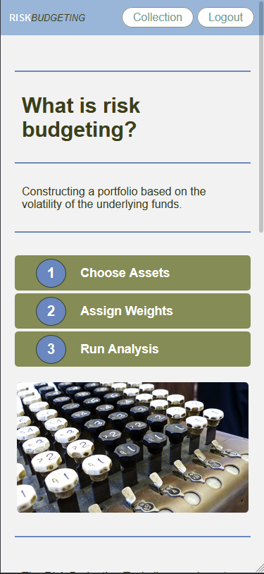
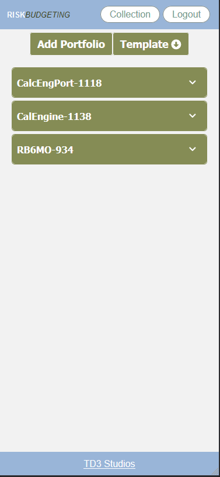
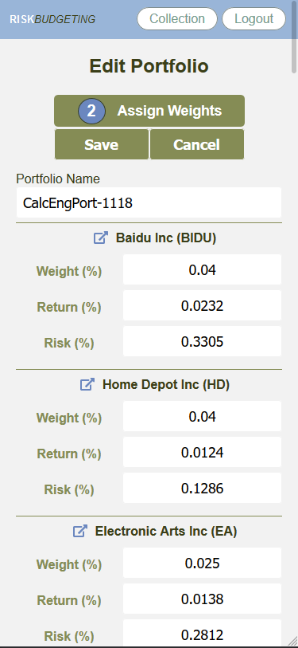
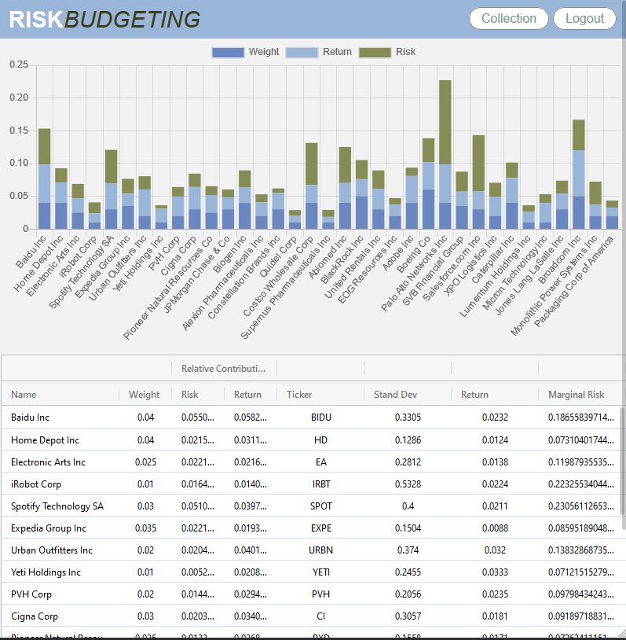

Risk Budgeting Tool

https://td3-riskbudget.now.sh/

Risk budgeting is a portfolio construction method where capital is allocated based on an individual assets risk and return contributions as it relates to other funds in the portfolio and the over-all investment strategy.

The Risk Budgeting Tool helps provide insight by taking in fund performance along with weight, risk, and return variables that can then be used to analyzed the portfolio and identify potential areas where capital may be redistributed.

&nbsp;&nbsp;&nbsp;&nbsp;
&nbsp;&nbsp;&nbsp;&nbsp; 

&nbsp;&nbsp;&nbsp;&nbsp;

Key Technologies:
React 
CSS
Node
Express
PostgreSQL
